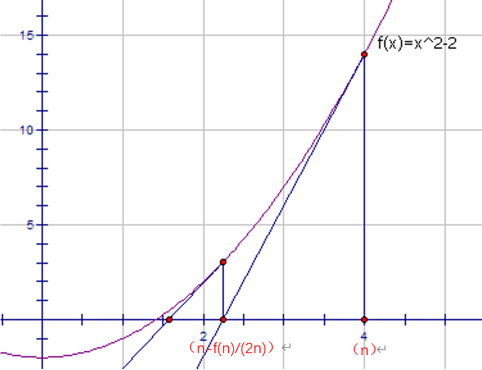

# 题目
输入一个正整数a，求它的平方根（输出为int，所以会丢弃小数部分）
***
## 牛顿迭代法
  
*f(x) = x2-a ①*  
根号a即为该方程在f(x)=0下的一象限的解  
*f'(x)=2x*  
设切线方程为 y=(2x)x+b  
∴ f(x)/(2x)=x+b/2x  
∴ x-f(x)/(2x)=-b/2x  
又x，y轴的截距是不同号的  
∴x-f(x)/(2x)=-b/2x=该切线的x轴截距，显然，该截距比x本身更接近方程①的解  
代入①，得  
x-f(x)/(2x)=x-(x2-a)/(2x)=(x+a/x)/2  
∴(x+a/x)/2是一个更精确的估计，如图1  
### C++实现
'''C++
class Solution {
public:
    int a;
    int mySqrt(int x) {
        a=x;
        if(!a) return 0;
        return sqrt(a);
    }
    int sqrt(double x){
        double res = (x+a/x)/2;
        if(res==x) return x;
        else return(sqrt(res));
    }
};
'''
***